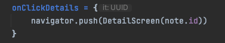

# JetNote
JetNote é um app feito com Compose e Kotlin, para fazer anotaçoes.

Usando:

* Compose - TextField
* Hilt
* MVVM
* ROOM Database com TypeConverters(convertendo tipo para primitivo)
* UI thread - suspend
* Navegação Compose com VOYAGER 
https://voyager.adriel.cafe/setup#platform-compatibility

